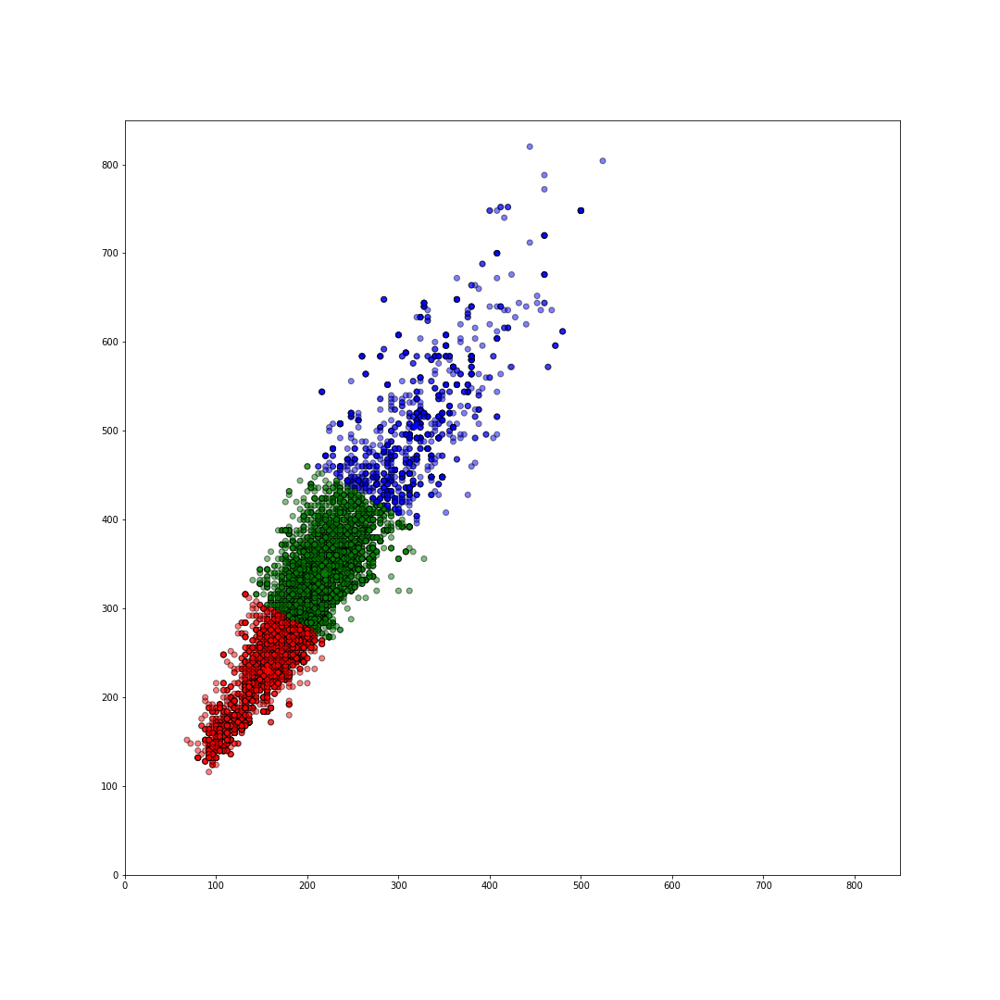
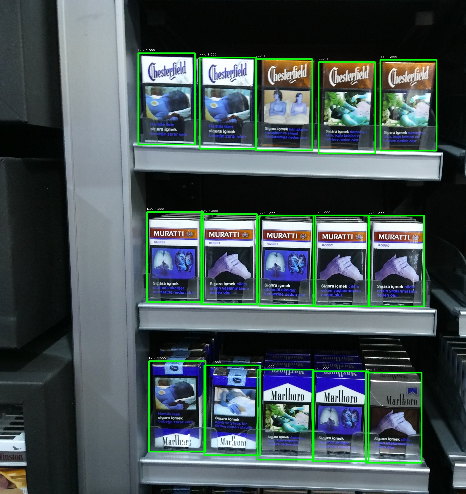
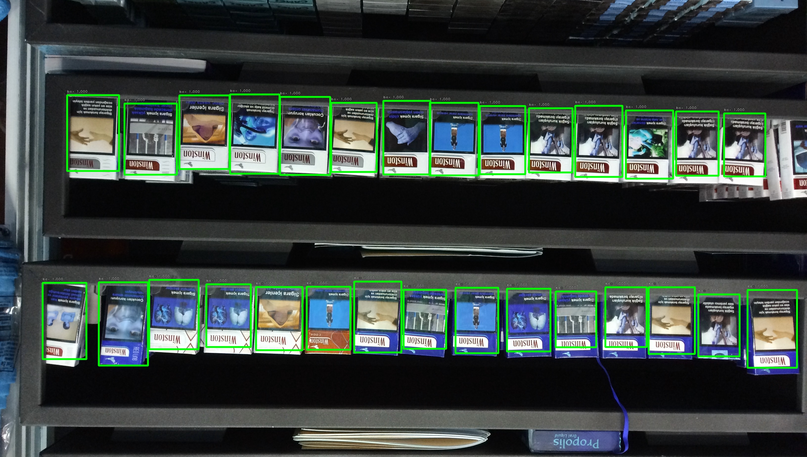

# GroceryDataset_part1

I have done full analysis based on provided data, find cluster of data with kmeans algorithm find out which anchor box (bounding box ratio) fit best in case of provided datasets got below result from various test 

```
look at analysis at kmeans_analysis+dataprep.ipynb
```

Given image with 3-cluster (3-bbox) which covers 82% of  data points.



```
# use ratio=0.67 to good fit for bbox, accuracy>75%
```

data pre-process script provided in ipython notebook, to split data to right format. 

model is train on single bbox with ratio is 0.67 and one class {0:'box'}, because data input label are incorrect .

start from installing  requirements.txt

```
pip install -r requirements.txt
```

 

```
python predict_from_model.py path/to/inputimages/

exp.
python predict_from_model.py /home/kk/Downloads/infilect/GroceryDataset_part1/ShelfImages/test/
```

some results from train model







```
{
    "mAP" : 0.80,
    "precision": 0.85,
    "recall": 0.85
}
```


